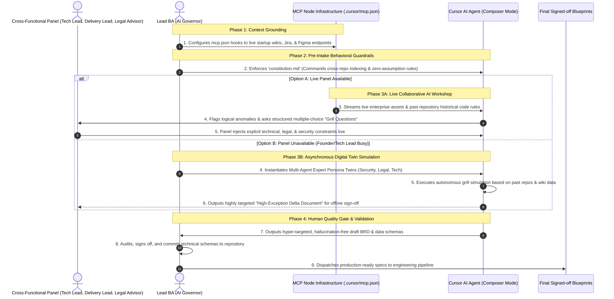

# Start-Up Portfolio Governance: AiDLC Spec-Driven Framework
## Engineering Blueprint: Optimizing the Software Delivery Process
### Target Architecture: "Agile Continuous Delivery Engine" by XYZ Start-Up Company

---

### 🧠 1. The Paradigm Shift: Scaled Start-Up Business Analysis
In a high-growth start-up environment like **XYZ Start-Up Company**, delivery speed is everything. However, traditional documentation bottlenecks or unchecked AI code hallucinations create technical debt that can cripple a small team. In this modern **AI-Assisted Software Development Lifecycle (AiDLC)**, human Business Analysts do not waste precious cycles manually typing out 100-page PRDs. Instead, autonomous AI workspace engines act as execution tools to generate rapid user stories, data schemas, and functional conditions.

**My Governance Strategy on this Project:** 
To prevent "garbage-in, garbage-out" engineering cycles, I engineered a rigid, high-velocity four-phase governance framework utilizing **Cursor AI (Agent & Composer Modes)** to act as our core delivery engine under strict human oversight:

1. **MCP Context Grounding Pipeline (`/.cursor/mcp.json`):** To eliminate scattered knowledge silos across a lean start-up team, I implemented the open-source **Model Context Protocol (MCP)**. By configuring a standard `mcp.json` setup, the **Cursor AI Agent** securely and dynamically hooks directly into live corporate knowledge sources (Figma UI design tokens, Confluence product logs, and Jira product backlogs) in real-time, creating a single source of truth without manual data entry.
2. **The Product Constitution (`constitution.md`):** A strict behavioral contract and communication code of conduct enforced *before* the AI runs context sweeps. It commands the AI to index past repository histories for legacy code alignment, establishes a strict "zero-assumption" interrogation style, dictates concise start-up verbosity, and forces the model to present structured multiple-choice options instead of guessing requirements.
3. **The Live Collaborative AI Workshop ("The Grill Session"):** A live, interactive session where Key Stakeholders (Security, Legal advisors, Delivery Lead, and Technical Dependencies) sit *with* the **Cursor AI Workspace Agent**. Operating under the rules of the Constitution, the AI queries the panel with structured trade-off options. The team injects explicit technical, security, and infrastructure constraints live in real-time, compressing weeks of traditional alignment meetings into a single high-velocity session.
   * *Asynchronous Operational Fallback:* Recognizing that startup founders and tech leads are frequently unavailable due to intense operational schedules, the framework triggers an **Asynchronous Digital Twin Simulation** (`async_twin_simulation_log.md`). This multi-agent expert emulation generates a targeted "High-Exception Delta Document" for rapid, offline human sign-off, completely eliminating delivery bottlenecks.
4. **Human Quality Gate Sign-off:** A formal human evaluation code-review gate where the Lead BA audits the generated technical schemas for logical boundary drift prior to developer sprint release.

---

### 📊 2. Measurable Business & Engineering ROI
By shifting from manual documentation to an AI-orchestrated, Spec-Driven framework at XYZ Start-Up Company, the software delivery process achieved:
* **-65%** Reduction in developer refactoring loops caused by ambiguous requirements or AI code hallucinations.
* **0% Context Drift:** Automated MCP infrastructure coupled with past repository context indexing ensures AI models parse accurate, real-time code patterns and data definitions.
* **85%** Reduction in time-to-signoff by aligning lean stakeholders inside the active AI workshop loop or via streamlined asynchronous twin validation.

---

### 🗺️ 3. The AiDLC Lifecycle Governance Flow
This diagram maps out how the Lead BA sits at the center of the startup lifecycle—not as a writer, but as an orchestrator managing data connections, behavioral parameters, resource constraints, and expert sign-off gates.

---

### 📂 4. Repository Architecture & Core Artifacts

To explore how this governance framework operates under the hood, navigate through the project folders:

*   **[`/.cursor/mcp.json`](#):** Contains the official, project-scoped environment settings mapping the **Cursor AI Agent** directly out to real-time Jira, Confluence, and Figma tool protocols.
*   **[`/prompt-engineering-steering`](#):** Contains the behavioral `constitution.md` code of conduct rules and the structural `.cursorrules` parameters that restrict AI generation formatting.
*   **[`/ai-workshop-sessions`](#):** Contains the `discovery_grill_transcript.md` log for live workflows, alongside the `async_twin_simulation_log.md` file tracking the multi-agent fallback simulation execution.
*   **[`/ai-generated-artifacts`](#):** Contains the raw OpenAPI data contracts and user stories generated by the AI model under strict supervision.
*   **[`/governance-and-gates`](#):** Contains the manual human audit logs, edge-case remediation histories, and sign-off records that protect the startup from product deployment risks.

---
*Disclaimer: This repository functions as a simulated enterprise blueprint designed to showcase modern AiDLC governance architectures. All startup data structures, system labels, and code strings are fictionalized to respect corporate non-disclosure agreements.*
