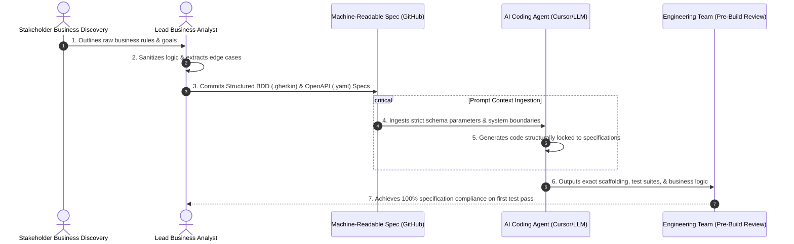

# AiDLC Spec-Driven Engineering Framework (Post-Discovery to Pre-Build)
## Fictional Blueprint: Core Micro-Lending Engine Modernization
### Mock Enterprise System: "OmniLoan Core" by ApexGlobal FinTech

### 🚀 1. The Strategic Paradigm Shift: What is this project?
In an **AI-Assisted Software Development Lifecycle (AiDLC)**, the primary bottleneck is no longer code generation velocity; it is **specification precision**. Vague requirements cause AI agents to hallucinate code, resulting in severe technical debt.

This repository demonstrates the **Post-Discovery to Pre-Build framework** engineered by the Lead Business Analyst. By creating mathematically precise, machine-readable specifications *before* a single line of application code is written, we ensure that both human engineers and AI coding models (like Cursor/Copilot) generate flawless, predictable, and production-ready microservices.

### 📊 2. Measurable Business & Engineering ROI
By shifting to an AiDLC Spec-Driven approach, the delivery pipeline achieved the following benchmarks:
* **-65%** Reduction in developer refactoring loops caused by ambiguous requirements.
* **0%** AI Agent code hallucinations during the implementation phase due to rigid data schema locking.
* **2.5x** Faster Time-to-Market (TTM) from post-discovery feature lock to functional pre-production builds.

---

### 🗺️ 3. The AiDLC Lifecycle Data Flow
This architecture map illustrates how the Lead BA transforms raw stakeholder discovery notes into AI-digestible, structured schemas that feed directly into pre-build prompt pipelines.

---
*Note: This repository is a simulated enterprise blueprint designed to showcase AiDLC governance models. All schemas and documentation are fictionalized to respect data security and intellectual property.*
